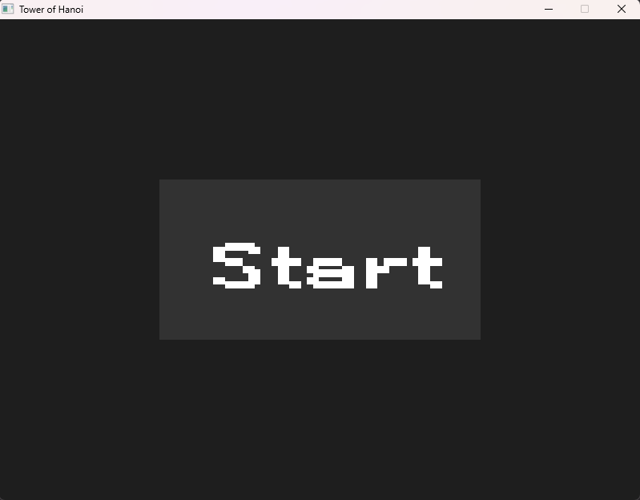
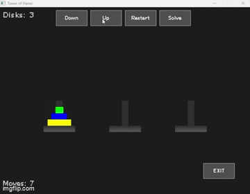
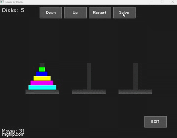

<html lang="en">
<body>
<h1>Hanoi Tower Game in C++</h1>

<h2>Table of Contents</h2>
<ul>
<li><a href="#introduction">Introduction</a></li>
<li><a href="#features">Features</a></li>
<li><a href="#libraries">Libraries</a></li>
<li><a href="#gameplay">GamePlay</a></li>
<li><a href="#how-it-works">How It Works</a></li>
</ul>

<h2 id="introduction">Introduction</h2>

The Hanoi Tower Game is a C++ implementation of the classic puzzle game. The game consists of three towers and a
number of disks of different sizes which can slide onto any tower. The puzzle starts with the disks in a neat stack in
ascending order of size on one tower, the smallest at the top, thus making a conical shape. The objective of the game is
to move the entire stack to another tower, obeying the following simple rules:

<ol>
<li>Only one disk can be moved at a time.</li>
<li>Each move consists of taking the upper disk from one of the stacks and placing it on top of another stack or on an
empty rod.</li>
<li>No disk may be placed on top of a smaller disk.</li>
<li>Game is win when all disks are placed on the <b>third</b> tower.</li>
</ol>

<h2 id="features">Features</h2>
<ul>
<li><strong>Basic Game Play</strong>: Users can grab disks between towers if the move is valid.</li>
<li><strong>Move Counter</strong>: Tracks the number of minimal moves needed to win game for the set number of
disks.</li>
<li><b>Restart</b>: Restart the game and position of the disks.</li>
<li><b>Up/Downn</b>: Change number of disks for the game in the <b>range 1 - 7</b></li>
<li><b>Exit</b>: Exit the game.</li>
<li><b>Solve</b>: Solves the game. When solving nothing else can be started.</li>
</ul>

<h2 id="libraries">Libraries</h2>

Libraries are part of the proejct and cmake. So there should be no need for installing them when main branch is pulled.

<ul>
<li><strong>SDL2</strong>: Simple DirectMedia Layer is a cross-platform development library designed to provide
                            low level access to audio, keyboard, mouse, joystick, and graphics hardware via
                            OpenGL and Direct3D.</li>
<li><strong>SDL2_TTF</strong>: SDL2 addon for text.</li>
</ul>

<h2 id="gameplay">Game Play</h2>
<ul>
<li>
First click on the start button to start the game. 

</li>
<li>
When game is started u can drag disks between towers if the move is correct.

</li>
<li>
You can change the number of disks.

</li>
<li>
The computer can solve the game. (3x speed up gif)

</li>
</ul>

<h2 id="how-it-works">How It Works</h2>
<ul>
    <li><strong>Disk</strong>: Represents the individual disks. Each disk has a size attribute.</li>
    <li><strong>Tower</strong>: Represents the towers. Each tower holds a stack of disks.</li>
    <li><strong>Game</strong>: Manages the game's state and rules.</li>
    <li><strong>GameController</strong>: Handles user input and communicates between the Game and GameView.</li>
    <li><strong>GameView</strong>: Responsible for displaying the current state of the game to the player.</li>
</ul>
</body>
</html>
